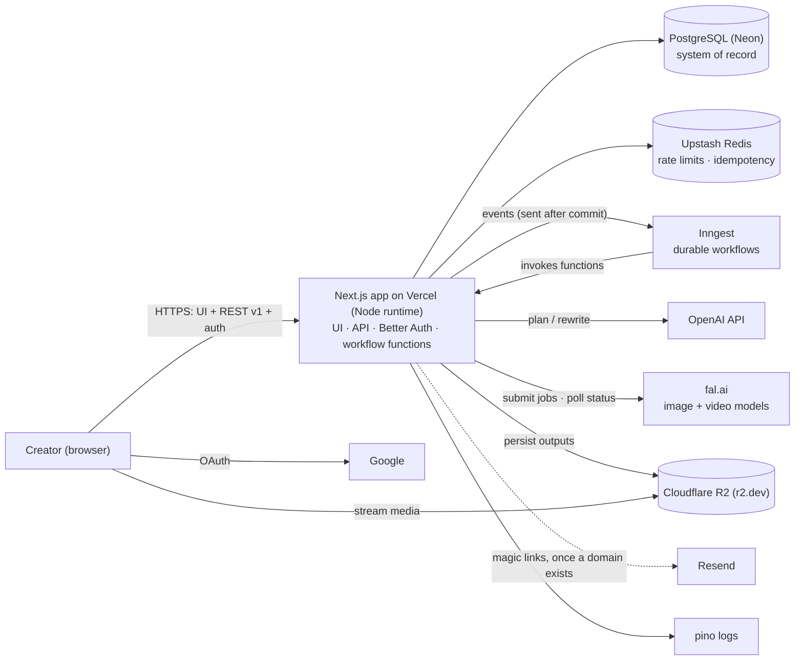
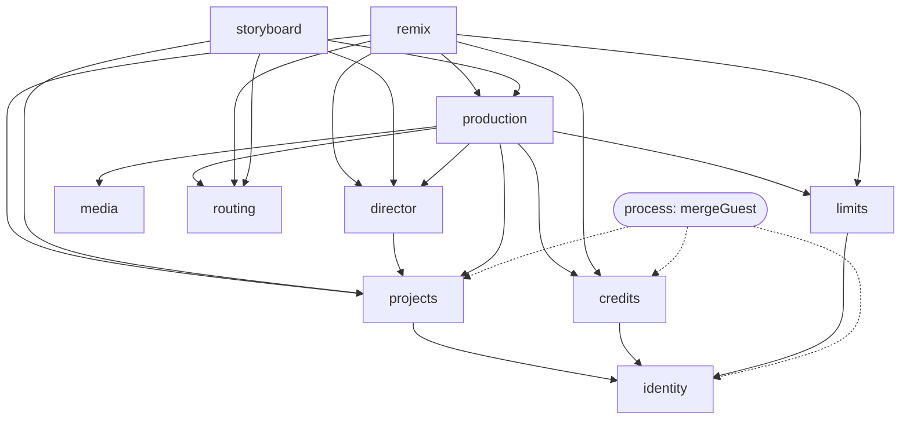
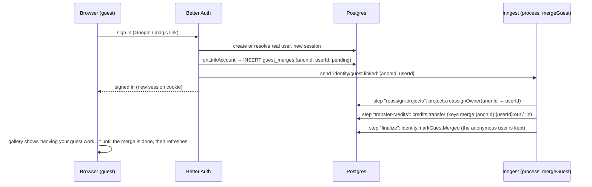
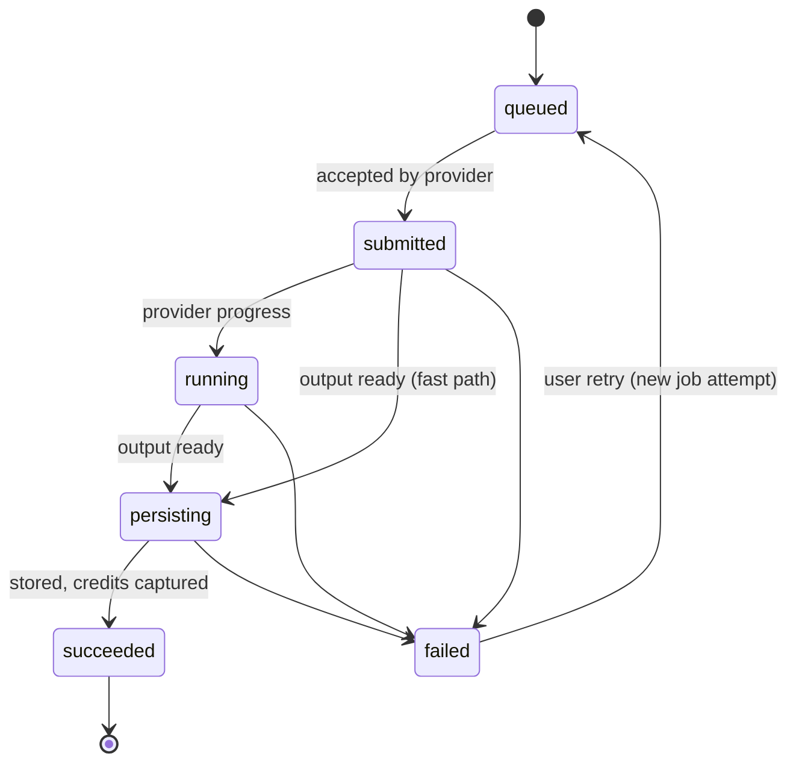
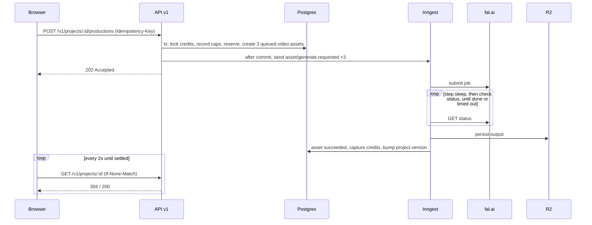

# Architecture — Director (a Higgsfield AI rebuild)

> **Status:** current · **Owners:** engineering · **Related:** [`frontend.md`](./frontend.md), [`standards.md`](./standards.md), [`adr/`](./adr/README.md), [`/AGENTS.md`](../AGENTS.md)
>
> `AGENTS.md` is the operational source of truth for agents. This document explains the *why* behind it.
>
> **Amended 2026-09-23** by [ADR-018](./adr/018-lean-core-for-the-24-hour-build.md) to [ADR-022](./adr/022-no-custom-domain-yet.md): lean core (no outbox, no webhooks), module boundary corrections, OpenAI as the LLM, npm, and no custom domain yet.

---

## 0. Framing: build the seams, document the scale

The system is judged on whether its architecture is **correct for the problem's real constraints**, **right-sized for today**, and **cleanly extensible for tomorrow**.

One rule follows from that: **every boundary that will matter at scale exists in the code today, but each is implemented with the simplest thing that is still correct.** Scaling means swapping an adapter or extracting a module, not rewriting the system. §14 makes that path explicit.

---

## 1. Architectural drivers

| # | Driver | Why it matters | Response |
|---|---|---|---|
| D1 | **Long-running generation** (video takes ~1–3 minutes) | Serverless requests time out; users refresh or leave | Durable workflows (Inngest); an async API that returns 202; clients read *our* state, never the provider's ([ADR-004](./adr/004-durable-workflows-inngest.md)) |
| D2 | **Unreliable external providers** | A provider outage must not become our outage | Ports + model registry; retries, timeouts, fallback models ([ADR-008](./adr/008-provider-ports-model-registry.md)) |
| D3 | **Money in motion** | Double charges, overdrafts and lost refunds destroy trust | Append-only credit ledger with reservations; idempotency everywhere ([ADR-007](./adr/007-credit-ledger-reservations.md)) |
| D4 | **Public access without a login wall** | Graders must use the app without signing in, yet anyone could drain the budget | Guest accounts via Better Auth, layered rate limits, a global spend kill-switch ([ADR-009](./adr/009-better-auth-guest-accounts.md), [ADR-016](./adr/016-rate-limits-spend-kill-switch.md)) |
| D5 | **Large binary outputs** | Provider URLs expire; video egress costs grow quickly | Persist outputs to our own object storage behind a CDN ([ADR-010](./adr/010-persist-media-r2.md)) |
| D6 | **Iterative creation** | Overwriting destroys work | Immutable, versioned assets forming a lineage tree ([ADR-011](./adr/011-immutable-versioned-assets.md)) |
| D7 | **Guest → account continuity** | Work done as a guest must survive sign-in | Deferred, idempotent guest merge via workflow ([ADR-009](./adr/009-better-auth-guest-accounts.md)) |

**The key scaling insight:** the bottleneck is **provider throughput and unit cost**, not our compute. The architecture invests in orchestration, routing and cost control, and keeps everything else simple.

---

## 2. System context and containers



| Container | Responsibility | Why |
|---|---|---|
| **Next.js app** (Vercel, Node runtime) | UI, REST API, Better Auth handler, workflow function host | One deployable, zero ops. Workflow code is *invoked by* Inngest, so it isn't bound by request lifetimes ([ADR-002](./adr/002-single-nextjs-app-node-runtime.md)) |
| **PostgreSQL (Neon)** | All domain data, auth tables, ledger | A relational aggregate, and the ledger needs transactions and row locks ([ADR-003](./adr/003-postgres-neon-drizzle.md)) |
| **Inngest** | Durable steps, retries, `step.sleep` polling, concurrency keys, crons | Solves D1/D2 without running any infrastructure |
| **fal.ai** (behind a port) | Image and image-to-video inference | Many models behind one queue API, polled from the workflow ([ADR-018](./adr/018-lean-core-for-the-24-hour-build.md)) |
| **OpenAI** (behind a port) | Brief → structured plan; remix rewrites | Structured outputs, validated again with zod ([ADR-020](./adr/020-openai-llm-provider.md)) |
| **Cloudflare R2** | Frames and videos | Zero egress fees, which is decisive for video; served from r2.dev until a domain exists ([ADR-022](./adr/022-no-custom-domain-yet.md)) |
| **Upstash Redis** | Rate limiting, idempotency responses | Serverless-native |
| **Resend** | Magic-link emails, once a domain is verified | Simple and reliable |
| **pino** | Structured logs | Correlation IDs on every event; Sentry is deferred |

---

## 3. Architecture style: a modular monolith with hexagonal modules

**One deployable**, split into **ten domain modules** (bounded contexts). Each module is internally hexagonal: domain, application, ports and infrastructure ([ADR-001](./adr/001-modular-monolith.md)).

### 3.1 Modules

| Module | Owns | Public API (examples) | Depends on |
|---|---|---|---|
| **identity** (Auth & Accounts) | Better Auth tables, `guest_merges` | `getCurrentUser`, `requireUser`, `markGuestMerged` | — |
| **director** (AI Director) | Director prompts, plan generation/validation, `PromptComposer`, remix rewrites | `planProject`, `composeFramePrompt`, `composeVideoPrompt`, `rewriteShot` | projects |
| **projects** (Project & Continuity) | projects, directions, shots, elements | `createProject`, `applyPlan`, `selectDirection`, `updateShot`, `updateElements`, `reassignOwner` | identity |
| **storyboard** | Frame generation and redraws | `generateFrames`, `redrawFrame` | projects, production, routing, director |
| **production** (Generation Engine) | assets, generation_jobs; generation workflows; stuck-job sweep | `produceDirection`, `requestGeneration`, `retryAsset` | projects, routing, credits, limits, media, director |
| **remix** (Remix & Versioning) | Single-shot remix → new asset version | `remixShot` | projects, production, routing, credits, limits, director |
| **routing** (Smart Select) | Model registry, routing policy, pricing | `selectModel`, `priceOf` | — |
| **credits** (Credits & Billing) | Append-only ledger | `grant`, `reserve`, `capture`, `release`, `transfer`, `balanceOf` | identity |
| **limits** (Usage Limits & Abuse) | Rate limits, caps, kill-switch | `assertCanGenerate`, `assertWithinRate`, `recordUsage` | identity |
| **media** (Storage & Delivery) | Object keys, persistence, delivery URLs | `persistFromUrl`, `urlFor` | — |

Cross-cutting code that is **not** a domain module ([ADR-019](./adr/019-module-boundary-corrections.md)):
- **Processes** live in `server/processes/*`: workflows that coordinate several modules through their public APIs (`mergeGuest`, `onboarding`). No module depends on a process.
- **Read queries** live in `server/queries/*`: read-only SQL for the workspace view and the gallery, the only code that reads across module tables.
- **Provider Integration** lives in `server/integrations/*`: adapters implementing module ports.
- **Live Status** comes from the workspace read query plus frontend polling.
- **Playback** is the frontend `features/studio`.
- **Observability** lives in `server/platform/observability`.

### 3.2 Module dependency graph (acyclic)



### 3.3 Inside a module

```
server/modules/<module>/
├─ domain/          entities, value objects, domain services, errors — pure, no I/O
├─ application/     one use-case class per file, single execute()
├─ ports/           interfaces the module needs (repositories, providers)
├─ infrastructure/  drizzle schema.ts, repositories, mappers, module-local adapters
├─ workflows/       Inngest functions owned by the module
└─ index.ts         PUBLIC API — the only import surface for other modules
```

Supporting code lives outside the modules:
- `server/processes/`: cross-module workflows (`mergeGuest`, `onboarding`) that call module public APIs.
- `server/queries/`: read-only SQL for the workspace view and gallery.
- `server/integrations/`: vendor adapters (fal, openai, r2, upstash, resend) and a fake for each port.
- `server/platform/`: the DB client, `UnitOfWork`, HTTP wrappers, the Inngest client, env and observability. The Better Auth instance and its generated schema live in `identity/infrastructure`.
- `server/container.ts`: the composition root.

### 3.4 Module rules

1. Import another module **only** through its `index.ts`.
2. A module never reads or writes another module's tables. Only `server/queries/` reads across them.
3. Synchronous cross-module writes in one transaction call public APIs with the shared `UnitOfWork`.
4. Asynchronous reactions use `step.sendEvent` inside workflows, or an event sent after commit from request handlers, with a one-minute sweep as the safety net ([ADR-018](./adr/018-lean-core-for-the-24-hour-build.md)).
5. No cycles. These rules are enforced by `eslint-plugin-boundaries` ([standards §9](./standards.md#9-enforcement)).

**Why this matters:** each module is a candidate service. `production` together with its integrations is already a coherent "Generation Service" that can be extracted when scale demands it (§14).

---

## 4. Identity and authentication

### 4.1 Model

- **Better Auth** with the Drizzle adapter, using the `anonymous` plugin (guests), Google OAuth and the `magicLink` plugin (via Resend) ([ADR-009](./adr/009-better-auth-guest-accounts.md)).
- **Everyone is a user.** Guests are `user` rows with `isAnonymous = true`. All domain data is owned by `user_id`, so there's one ownership model, one authorisation check, and no separate "guest tables."
- **No login wall.** Landing, the demo project and the gallery render without a session.
- A guest identity is created **on the first meaningful action** (submitting a brief), not on page load. This stops bots and crawlers from minting rows.

### 4.2 Guest → account linking and merge

Better Auth's anonymous plugin calls `onLinkAccount` when a guest signs in. That callback runs **after** the new session is issued and is **not atomic** with sign-in. A failure halfway through would strand the guest's work on an unreachable row. So the design keeps the callback trivial and does the real work in a durable, idempotent workflow:



- The merge is a **process** (`server/processes/mergeGuest`), not identity's own workflow: it calls the public APIs of identity, projects and credits, so there is no dependency cycle ([ADR-019](./adr/019-module-boundary-corrections.md)).
- `disableDeleteAnonymousUser: true` is set on the plugin, and the anonymous user is never deleted: its append-only ledger rows reference it.
- If the event send fails, the one-minute sweep re-sends every `pending` merge. Every step is idempotent (guarded updates plus unique ledger keys), so retries are safe.
- The sign-up bonus is not part of the merge. The `onboarding` process grants it once per real user (`grant:signup:{userId}`), whether or not they were a guest.
- `GET /api/v1/me` exposes `pendingMerge: boolean` so the UI can show an honest transitional state.

### 4.3 Authorisation

- Route handlers and RSC resolve the user through `requireUser()` / `getCurrentUser()` (the `withUser` wrapper).
- Use cases receive `userId` as an argument and never read cookies or headers.
- Every query and command checks ownership (`WHERE user_id = $userId`). IDs coming from the client are never trusted on their own.
- The demo project is readable by anyone (`is_demo = true`) and writable by no one.

---

## 5. Data design

### 5.1 Ownership by module

| Module | Tables |
|---|---|
| identity | `user` (incl. `is_anonymous`), `session`, `account`, `verification` (Better Auth-generated), `guest_merges` |
| projects | `projects`, `directions`, `shots` |
| production | `assets`, `generation_jobs` |
| credits | `credit_ledger` |
| limits | `usage_daily` |
| director | `llm_calls` (observability of planning/remix calls) |

### 5.2 Schema (abridged)

```sql
-- projects
projects (
  id text pk, user_id text not null references "user"(id),
  title text, brief text not null,
  elements jsonb,                        -- {character, location, style}: continuity context
  aspect_ratio text not null,            -- 16:9 | 9:16 | 1:1
  style_tags text[],                     -- optional style chips from the brief
  status text not null,                  -- planning | planned | selected | producing | ready | failed
  selected_direction_id text,
  is_demo boolean default false,
  version integer not null default 0,    -- bumped on any change → ETag for polling
  created_at timestamptz default now(), updated_at timestamptz default now()
);
directions ( id text pk, project_id text references projects(id), ordinal smallint, name text, tagline text, style_prompt text );
shots ( id text pk, direction_id text references directions(id), ordinal smallint, title text, description text,
        camera_motion text check (camera_motion in (/* from contracts/enums */)),
        lighting text, mood text, duration_s smallint, prompt text,
        frame_stale boolean not null default false,          -- edited since its frame was drawn
        current_frame_asset_id text, current_video_asset_id text );

-- production
assets (
  id text pk, shot_id text references shots(id), kind text check (kind in ('frame','video')),
  version integer not null, parent_asset_id text references assets(id),
  status text not null,                                   -- saved with guarded updates (ADR-018)
  storage_key text, meta jsonb, cost_credits integer not null,
  created_at timestamptz default now(),
  unique (shot_id, kind, version)
);
generation_jobs (
  id text pk, asset_id text references assets(id), attempt smallint not null,
  provider text not null, model text not null,
  provider_request_id text unique, status text not null,
  input jsonb, error jsonb, cost_usd_estimate numeric(10,4),
  submitted_at timestamptz, completed_at timestamptz
);
-- no webhook inbox in v1: the workflow polls provider status (ADR-018)

-- credits
credit_ledger (
  id bigserial pk, user_id text not null references "user"(id),
  entry_type text not null,              -- grant | reserve | release | capture | transfer_in | transfer_out
  amount integer not null,               -- signed; balance = SUM(amount)
  asset_id text, idempotency_key text unique not null,
  created_at timestamptz default now()
);

-- limits
usage_daily ( day date, scope text, scope_id text, videos integer default 0, spend_usd numeric(10,4) default 0,
              primary key (day, scope, scope_id) );          -- scope: user | global

-- identity (besides the Better Auth tables)
guest_merges ( anonymous_user_id text pk, user_id text not null, status text not null,  -- pending | done
               created_at timestamptz default now(), completed_at timestamptz );
```

Indexes:
- `projects(user_id, created_at desc)`
- `assets(shot_id, kind, version desc)`
- `generation_jobs(status, submitted_at)` for the stuck-job sweep
- `credit_ledger(user_id)`
- `guest_merges(status) where status = 'pending'` for the sweep

### 5.3 Asset state machine



Transitions come from a data table in `production/domain`. The repository saves with `WHERE id = $1 AND status = $expected`, so a retried step can never double-apply a transition ([ADR-018](./adr/018-lean-core-for-the-24-hour-build.md)).

---

## 6. Credits (money correctness)

Balance = `SUM(amount)` over an **append-only** ledger ([ADR-007](./adr/007-credit-ledger-reservations.md)).

| Moment | Entry | Amount | Idempotency key |
|---|---|---|---|
| Guest's first action | `grant` | +40 | `grant:guest:{userId}` |
| First real sign-in | `grant` | +60 | `grant:signup:{userId}` |
| Guest merge | `transfer_out` / `transfer_in` | ∓ guest balance | `merge:{anonId}:{userId}:out` / `:in` |
| Generation requested | `reserve` | − cost | `asset:{id}:reserve` |
| Generation succeeded | `capture` | 0 (audit marker) | `asset:{id}:capture` |
| Generation failed permanently | `release` | + cost | `asset:{id}:release` |

**Reservation is synchronous and transactional.** Within one `UnitOfWork`:
1. Lock the user's credit account (`SELECT … FOR UPDATE` on a per-user row).
2. Compute the balance, and check and record the video caps (`limits.recordUsage`).
3. Append `reserve`.
4. Create the assets in `queued`.
5. After commit, send the generation events. The sweep re-sends for any asset still `queued` ([ADR-018](./adr/018-lean-core-for-the-24-hour-build.md)).

This means concurrent clicks cannot overdraw, and users get an immediate `402` rather than a delayed failure. When payments are added later, a Stripe webhook simply writes `grant` entries.

---

## 7. Generation orchestration

### 7.1 Why durable workflows

The alternatives were: holding the request open (❌ times out), browser-driven polling of the provider (❌ closing the tab strands work), a cron sweeper (⚠️ slow, hand-rolled), raw queues (⚠️ you hand-build retries and waits), and Temporal (best at large scale, heavy for an MVP). **Inngest** gives step retries, `waitForEvent`, timeouts, concurrency keys, crons and run history with zero infrastructure. Temporal is the named migration target ([ADR-004](./adr/004-durable-workflows-inngest.md)).

### 7.2 Events without an outbox

The lean core has no outbox table ([ADR-018](./adr/018-lean-core-for-the-24-hour-build.md)):
- **Inside workflows,** functions chain with `step.sendEvent`, which Inngest makes durable.
- **From request handlers,** the event is sent after the transaction commits. The entity's own status is the durable record: an asset still `queued` or a merge still `pending` after a minute is re-sent by the sweep.

Consumers are idempotent (guarded updates and unique ledger keys), so a re-sent event is harmless.

### 7.3 Workflows

| Workflow | Module | Trigger | Steps |
|---|---|---|---|
| `project.plan` | director | `project/created` | plan (LLM structured output → zod, one repair retry) → `projects.applyPlan` → `step.sendEvent("project/planned")` |
| `frames.generate` | storyboard | `project/planned` | compose each frame prompt (via director) → `production.requestGeneration` for the 9 frames |
| `asset.generate` | production | `asset/generate.requested` | submit → poll the provider's status with `step.sleep` until done or timed out → on failure, retry on the fallback model → persist to R2 → finalize (state, capture/release, shot pointer, `project.version++`) |
| `sweep` | production + processes | cron (1 min) | re-send events for assets still `queued` and merges still `pending`; fail jobs past their timeout |
| `mergeGuest` | process | `identity/guest.linked` | reassign projects → transfer credits → mark merged (the anonymous user is kept) |

### 7.4 Production sequence



**Concurrency control:** `concurrency: [{ key: "model:" + model, limit: N }, { key: "user:" + userId, limit: 3 }]`. This respects provider rate limits and prevents one user from starving others.

**No inbound webhooks in v1.** Polling keeps local development and the fake provider simple. Webhooks with ED25519/JWKS signature verification are the scale path ([ADR-018](./adr/018-lean-core-for-the-24-hour-build.md)).

---

## 8. Provider abstraction and Smart Select

```ts
interface MediaProvider {
  submit(req: GenerationRequest): Promise<{ requestId: ProviderRequestId }>;
  status(requestId: ProviderRequestId): Promise<ProviderStatus>;   // polled by the workflow
}
interface LLMProvider {
  structured<T>(o: { system: string; input: string; schema: ZodType<T>; purpose: string }): Promise<T>;
}
```

The **model registry** (in the routing module) records each model's ID, provider, capabilities, credit cost, typical latency, quality tier and fallback order. **Smart Select** is a routing policy over the registry: given a shot's needs (kind, duration, aspect ratio), it returns a model plus a human-readable reason for the UI. The user never picks a model. The same policy drives fallback ([ADR-008](./adr/008-provider-ports-model-registry.md)).

**Image-to-video uses the approved storyboard frame as the first frame**, so what the user approves is what they get ([ADR-017](./adr/017-storyboard-frame-as-first-frame.md)).

---

## 9. API design

REST under `/api/v1`, with contracts as zod schemas in `src/contracts` shared by client and server ([ADR-012](./adr/012-rest-route-handlers-over-server-actions.md)).

| Method | Path | Purpose | Notes |
|---|---|---|---|
| GET | `/v1/me` | User, guest flag, credits, caps, `pendingMerge` | — |
| POST | `/v1/projects` | Brief → start planning | `Idempotency-Key` · 202 |
| GET | `/v1/projects` | Gallery (+ demo) | cursor pagination |
| GET | `/v1/projects/:id` | Workspace read model | `ETag` = version → 304 |
| PATCH | `/v1/projects/:id/elements` | Edit continuity elements | `If-Match` |
| PATCH | `/v1/shots/:id` | Edit shot recipe | `If-Match` |
| POST | `/v1/projects/:id/selection` | Select a direction | 200 |
| POST | `/v1/projects/:id/productions` | Produce the selected direction | `Idempotency-Key` · 202 / 402 / 429 |
| POST | `/v1/shots/:id/remixes` | Remix one shot | `Idempotency-Key` · 202 |
| POST | `/v1/shots/:id/frame` | Redraw a shot's frame after edits | free, rate-limited · 202 |
| POST | `/v1/assets/:id/retries` | Retry a failed asset | 202 |
| * | `/api/auth/*` | Better Auth | — |
| * | `/api/inngest` | Workflow endpoint | signed by Inngest |

- **Handler shape:** `compose(withErrorHandling, withRequestContext, withUser, withRateLimit, withIdempotency)(parse → useCase.execute → respond)`.
- **Error envelope:** `{ "error": { "code": "INSUFFICIENT_CREDITS", "message": "…", "retryable": false } }`.
- **Idempotency:** money-spending POSTs require `Idempotency-Key`. Responses are stored in Redis for 24h.
- **Live updates:** clients poll the read model with ETags. This sits behind one frontend hook, so moving to push updates is a local change ([ADR-013](./adr/013-polling-read-model-etag.md)).

---

## 10. Security and abuse prevention

| Threat | Control |
|---|---|
| Budget draining | Guest caps (tight) and user caps (looser); per-user and per-IP sliding windows (Upstash); a **global daily spend kill-switch** checked before every submit; users are routed to the demo project when caps are hit ([ADR-016](./adr/016-rate-limits-spend-kill-switch.md)) |
| Bot-minted guest accounts | Guest identity created only on the first meaningful action; per-IP rate limit on anonymous sign-in |
| Session security | Better Auth sessions (httpOnly, Secure, SameSite=Lax); trusted origins configured; CSRF protection on auth routes |
| Cross-user access | Ownership enforced in every query and command; the demo is read-only |
| Forged webhooks | None accepted in v1: the workflow polls provider status ([ADR-018](./adr/018-lean-core-for-the-24-hour-build.md)) |
| Prompt injection via brief | LLM output is schema-validated and only ever becomes data; brief length capped |
| Unsafe content | Provider safety checkers enabled; `CONTENT_REJECTED` state with credits released |
| Secrets | Vercel env only, validated at boot; `.env*` gitignored; secret scanning enabled |
| Media access | Public r2.dev bucket with unguessable keys `u/{userId}/p/{projectId}/s/{shotId}/{assetId}.{ext}` ([ADR-022](./adr/022-no-custom-domain-yet.md)); signed URLs on the scale path |

---

## 11. Observability and unit economics

- Every log line carries `requestId`, `userId`, `projectId`, `assetId` and `jobId`. Sentry is deferred ([ADR-018](./adr/018-lean-core-for-the-24-hour-build.md)).
- Inngest run history serves as the operations dashboard, with step-level failures and replay.
- Cost tracking: `generation_jobs.cost_usd_estimate` plus `llm_calls` token counts give **cost per project** and **cost per successful video**.
- **Key metrics:**
  - Time to first frame.
  - Video success rate by model.
  - p50/p95 latency by model.
  - Fallback rate.
  - Credits reserved vs captured.
  - Guest → account conversion.

---

## 12. Testing strategy (summary)

The lean test pyramid ([ADR-018](./adr/018-lean-core-for-the-24-hour-build.md)):
- Domain unit tests for the invariants (credits, asset lifecycle, direction selection).
- Use-case tests with in-memory fakes.
- Shared **contract suites** for the `MediaProvider` and `LLMProvider` implementations.
- One integration test against a real Postgres (Neon test branch): concurrent credit reservations never overdraw.
- One Playwright journey using the fake providers.

Details are in [`standards.md` §8](./standards.md#8-testing-strategy).

---

## 13. Built now vs designed for later

| Capability | Built now | Designed / documented |
|---|---|---|
| Modular monolith, hexagonal modules, boundary lint | ✅ | Service extraction |
| Better Auth: guests, Google, deferred merge (magic link built, hidden live) | ✅ | Organisations/teams, passkeys |
| Durable workflows, retries, fallback, concurrency keys | ✅ | Temporal migration |
| Status polling + one-minute sweep | ✅ | Webhooks with signature verification, outbox + inbox |
| Credit ledger with reservations and transfers | ✅ | Stripe purchases → `grant` |
| R2 persistence (r2.dev) | ✅ | Custom domain, signed URLs, multi-region |
| Caps, rate limits, kill-switch | ✅ | Tiered quotas per plan |
| Polling with ETag | ✅ | Push updates |
| Registry + Smart Select | ✅ basic | Health- and cost-aware routing |
| Tests: invariants, use cases, provider contracts, one integration, one e2e | ✅ | Coverage gate, repository contracts, load tests |

---

## 14. Scaling path

| Stage | Load | Changes | Trigger |
|---|---|---|---|
| **1 · MVP** | Hundreds of users; tens of concurrent jobs | As built | — |
| **2 · Growth** | ~100k users; thousands of concurrent jobs | Stripe purchases write ledger grants · plan tiers with separate concurrency lanes · push updates replace polling · Neon read replica for read models · Redis cache for hot workspaces · multiple provider accounts | Provider throttling, polling load, paying users |
| **3 · Scale** | Millions of users | Extract the **production** module (+ integrations) as a Generation Service with its own schema · migrate orchestration to Temporal if needed · self-hosted GPU inference for high-volume models (the largest cost lever) · time-partitioned `assets`/`generation_jobs` · analytics warehouse · multi-region storage | Unit economics, vendor risk, team topology |

The module boundaries make stage 3 an **extraction, not a rewrite**.

---

## 15. Decisions

All significant decisions are recorded as ADRs in [`docs/adr/`](./adr/README.md).
