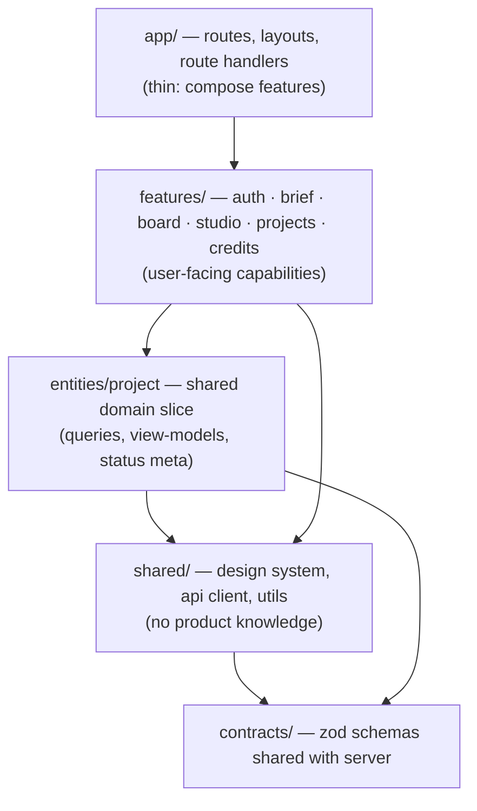

# Frontend Architecture — Director (a Higgsfield AI rebuild)

> **Status:** current · **Related:** [`architecture.md`](./architecture.md), [`standards.md`](./standards.md), [`adr/`](./adr/README.md), [`/AGENTS.md`](../AGENTS.md)
>
> Covers the Next.js frontend. Coding standards for the whole application live in [`standards.md`](./standards.md).

---

## 1. Principles

1. **Server-first.** React Server Components (RSC) are the default. Client components are *islands* that exist only where there's interactivity. This means less JavaScript, faster first paint, and data fetched next to its source.
2. **Four kinds of state, four homes.** Server state, URL state, form state and local UI state each get a dedicated tool. Mixing them is the most common source of frontend rot.
3. **One contract.** Frontend and backend share zod schemas from `src/contracts`. The UI can't drift from the API, because both are compiled from the same definitions.
4. **Features, not file types.** Code is organised by product capability (brief, board, studio), not by technical category (components, hooks, utils). Each feature exposes a small public API.
5. **Every async state is designed.** Loading, empty, error, partial and success states are designed deliberately, never left to chance. For a product built on 1–3 minute generations, the waiting experience *is* the product.

## 2. Rendering strategy per route

| Route | Rendering | Why |
|---|---|---|
| `/` (Brief) | RSC shell (static) + client `BriefForm` island | Instant load; the only interactive part is the form |
| `/p/[projectId]` (Board / Studio) | RSC loads the project aggregate server-side → hydrates the TanStack Query cache → client workspace polls for updates | No loading spinner on first paint; live updates afterward; one render path for both phases |
| `/projects` | RSC, dynamic (session-scoped) | Simple list, no client state needed |
| `error.tsx` / `not-found.tsx` / `loading.tsx` per segment | Next.js file conventions | Failures are contained to their route segment and every one has a designed state |

**How reads and writes are split:**
- **Reads in RSC** call module query functions *directly* through the module's public API (e.g. `getWorkspaceView` from `@/server/modules/projects`), with no HTTP round trip to our own API.
- **Writes go through the REST API (`/api/v1`)** via a typed client.

**REST route handlers over Server Actions for mutations ([ADR-012](./adr/012-rest-route-handlers-over-server-actions.md)).** Mutations here spend money, so they need `Idempotency-Key` headers, stable HTTP status codes (202/402/429) and a public contract that a future mobile app or partner API could reuse. Server Actions are convenient but couple the contract to React and make those HTTP semantics awkward. Both paths call the *same* application use cases, so nothing is duplicated.

```tsx
// app/p/[projectId]/page.tsx — thin: resolve user, load, hydrate, render
import { getCurrentUser } from "@/server/modules/identity";
import { getWorkspaceView } from "@/server/modules/projects";

export default async function ProjectPage({ params }: { params: Promise<{ projectId: string }> }) {
  const { projectId } = await params;
  const user = await getCurrentUser();                         // null for visitors without a session
  const project = await getWorkspaceView(projectId, { viewerId: user?.id }); // owner or demo only
  if (!project) notFound();

  return (
    <HydrationBoundary state={dehydrateProject(project)}>
      <ProjectWorkspace projectId={projectId} />
    </HydrationBoundary>
  );
}
```

## 3. Layering and folder structure

The structure is inspired by Feature-Sliced Design, trimmed to what this app needs.



```
src/
├─ app/                               # routing only — no business logic
│  ├─ layout.tsx  page.tsx  error.tsx  not-found.tsx
│  ├─ p/[projectId]/{page,loading,error}.tsx
│  ├─ projects/page.tsx
│  ├─ sign-in/page.tsx
│  └─ api/…                           # (backend — see architecture.md)
├─ features/
│  ├─ auth/         components/{SignInDialog,AccountMenu,GuestBanner,MergeNotice}.tsx
│  │                hooks/{useMe,useEnsureGuest}.ts  lib/authClient.ts  index.ts
│  ├─ brief/        components/ hooks/ index.ts
│  ├─ board/        components/{DirectionRow,ShotCard,ShotRecipePanel,ElementsBar}.tsx
│  │                hooks/{useSelectDirection,useUpdateShot}.ts  index.ts
│  ├─ studio/       components/{SequencePlayer,ShotTimeline,RemixPanel,VersionStrip}.tsx
│  │                hooks/{useRemixShot,useRetryAsset,usePlayer}.ts  index.ts
│  ├─ projects/     components/ index.ts
│  └─ credits/      components/CreditsBadge.tsx  index.ts          # reads credits from useMe
├─ entities/
│  └─ project/      api/queries.ts        # query keys + queryOptions factories
│                   hooks/useProject.ts   # polling read model
│                   model/viewModels.ts   # DTO → UI shape (pure, tested)
│                   model/statusMeta.ts   # status → label/tone/terminal/announce
│                   index.ts
├─ shared/
│  ├─ ui/           # design system: Button, Card, Sheet, StatusBadge, Skeleton,
│  │                # AsyncBoundary, EmptyState, ErrorState (wrapping shadcn/Radix)
│  ├─ lib/          # apiClient.ts, apiErrors.ts, idempotency.ts, format.ts, cn.ts
│  └─ config/       # env.client.ts (zod-validated NEXT_PUBLIC_* only)
├─ contracts/       # zod schemas + inferred types, shared with server
└─ server/          # backend (modular monolith) — never imported by client code
```

**Import rules (enforced by ESLint; see [`standards.md` §9](./standards.md#9-enforcement)):**
- `app → features → entities → shared → contracts`. Imports only flow downward.
- **Features never import other features.** Anything two features share moves down into `entities/` or `shared/`.
- Other code imports from a slice's `index.ts` only. Deep imports like `features/board/components/ShotCard` from outside are blocked.
- `server/` can never be imported from client components. `import "server-only"` guards it at build time.
- RSC files may import only a module's public `index.ts` (`@/server/modules/<module>`), never its internals.
- The auth client (`better-auth/react`) is imported only inside `features/auth`. Other features use `useMe()`.

## 4. State management

| State type | Examples | Tool | Why |
|---|---|---|---|
| **Server state** | Project aggregate, asset statuses, session credits | **TanStack Query** | Caching, deduplication, polling that stops itself, optimistic updates, retry. This is ~90% of the app's state |
| **URL state** | Selected shot, open panel, selected version | **`nuqs`** (typed search params) | Deep-linkable, refresh-safe, back button works. Graders can share a link straight to a shot |
| **Form state** | Brief, shot recipe, remix instruction | **react-hook-form + zodResolver** (reusing the `contracts/` schemas) | The same validation rules run on client and server |
| **Local UI state** | Hover, player time, disclosure toggles | `useState` / `useReducer` (player uses a reducer + context scoped to the Studio) | Keep state as local as possible |

**No global store (Redux, Zustand).** Nothing in this app needs cross-cutting client state, because server state lives in the query cache. Adding a store would create a second source of truth. ([ADR-014](./adr/014-client-state-tanstack-query-nuqs.md))

### The polling read model

```ts
// entities/project/hooks/useProject.ts
export function useProject(projectId: string) {
  return useQuery({
    ...projectQuery(projectId),
    // Poll only while something is in flight; stop automatically when all assets are terminal.
    refetchInterval: (query) => (query.state.data && isSettled(query.state.data) ? false : 2000),
    refetchIntervalInBackground: false,
  });
}
```

`projectQuery` sends `If-None-Match` with the last `version`. A `304` returns the cached data unchanged, so polling costs almost nothing. The rest of the UI only ever calls `useProject()`. Replacing polling with server push later is a change to this one file.

### Mutations with idempotency

```ts
// features/studio/hooks/useRemixShot.ts
export function useRemixShot(projectId: string) {
  const qc = useQueryClient();
  return useMutation({
    // idempotencyKey is created by the caller once per user click and passed in,
    // so network or library retries reuse it — never a new key per attempt.
    mutationFn: (v: { shotId: string; instruction: string; idempotencyKey: string }) =>
      api.shots.remix(v.shotId, { instruction: v.instruction }, { idempotencyKey: v.idempotencyKey }),
    onMutate: (v) => optimisticallyAddQueuedVersion(qc, projectId, v.shotId),   // instant feedback
    onError: (_e, _v, ctx) => rollback(qc, projectId, ctx),
    onSettled: () => qc.invalidateQueries({ queryKey: projectKeys.detail(projectId) }),
  });
}
```

## 5. The typed API client

```ts
// shared/lib/apiClient.ts (sketch)
async function request<T>(schema: ZodType<T>, path: string, init: RequestInit & { idempotencyKey?: string }) {
  const res = await fetch(`/api/v1${path}`, {
    ...init,
    headers: {
      "Content-Type": "application/json",
      ...(init.idempotencyKey && { "Idempotency-Key": init.idempotencyKey }),
      ...init.headers,
    },
  });
  if (!res.ok) throw ApiError.fromResponse(await res.json(), res.status);   // typed error codes
  return schema.parse(await res.json());                                   // validate at the boundary
}

export const api = {
  projects: {
    create: (body: CreateProjectInput, o: { idempotencyKey: string }) =>
      request(CreateProjectResponse, "/projects", { method: "POST", body: JSON.stringify(body), ...o }),
    get: (id: string) => request(ProjectDTO, `/projects/${id}`, { method: "GET" }),
  },
  shots: { remix: /* … */ },
  // …
};
```

Responses are **parsed, not cast**. If the backend ever breaks the contract, you get a clear error at the boundary instead of an `undefined` deep inside a component.

**One place for error copy:** `shared/lib/apiErrors.ts` maps each stable error code (`insufficient_credits`, `rate_limited`, `content_rejected`, `generation_failed`, …) to user-facing copy and a suggested action (retry, view the demo project, edit the prompt). No component invents its own error text.

## 6. Component patterns

**Container / presentational via hooks.** Feature hooks own data and behaviour, and components own markup.
```tsx
export function ShotCardContainer({ shotId }: { shotId: string }) {
  const shot = useShotViewModel(shotId);          // data + derived state
  const { open } = useShotPanel();                // URL state
  return <ShotCard shot={shot} onOpen={() => open(shotId)} />;   // pure, easy to test
}
```

**View models.** Components never interpret raw DTOs. Pure functions in `entities/project/model/viewModels.ts` turn API data into exactly what the UI needs: display label, progress state, elapsed time, "can remix", cost. These are unit-tested without rendering anything.

**Exhaustive status maps.**
```ts
export const assetStatusMeta = {
  queued:     { label: "Queued",       tone: "muted",   terminal: false, announce: "Shot queued" },
  submitted:  { label: "Starting",     tone: "info",    terminal: false, announce: "Generation started" },
  running:    { label: "Generating",   tone: "info",    terminal: false, announce: null },
  persisting: { label: "Finishing",    tone: "info",    terminal: false, announce: null },
  succeeded:  { label: "Ready",        tone: "success", terminal: true,  announce: "Shot ready" },
  failed:     { label: "Failed",       tone: "danger",  terminal: true,  announce: "Shot failed" },
} satisfies Record<AssetStatus, StatusMeta>;
```
`satisfies Record<…>` makes the compiler fail if a new backend status is added without a UI treatment. That's the open/closed principle with a compile-time guarantee (see [`standards.md` §3](./standards.md#3-solid-across-the-backend)).

**Compound components** for complex, composable UI:
`<ShotCard.Root><ShotCard.Media/><ShotCard.Meta/><ShotCard.Actions/></ShotCard.Root>`. The Board and Studio compose the same pieces differently without sprouting boolean props like `showActions` or `compact`.

**AsyncBoundary** (`shared/ui`) wraps `Suspense` + an `ErrorBoundary` + a retry button, so every async region gets consistent loading and error handling from one component.

**Variants with `cva`** (class-variance-authority) for design-system components. There are no ad-hoc className ternaries scattered through features.

## 7. Design system and accessibility

- **Tokens as CSS variables** (colour, radius, spacing, motion durations) mapped into the Tailwind theme. The dark cinematic theme is a token set, not scattered hex codes.
- **shadcn/Radix primitives wrapped in `shared/ui`.** Features import `@/shared/ui`, never Radix directly, so the design system has a single point of change.
- **Accessibility built in:**
  - Radix provides focus management for sheets and dialogs.
  - An `aria-live="polite"` region announces generation status changes (using `announce` from the status map). Screen-reader users hear "Shot 2 ready" without polling the page themselves.
  - Every icon button has a label, and the whole flow works with the keyboard alone (⌘/Ctrl+Enter submits the brief, Esc closes panels, arrow keys move between shots on the timeline).
  - Animations respect `prefers-reduced-motion`.
- **Motion** comes from a small set of tokenised transitions (frame fade-in, panel slide) and is never decorative on critical paths.

## 8. Performance

- RSC keeps the Brief and Projects pages close to zero client JavaScript.
- The player and remix panel are loaded with `next/dynamic`, only when needed.
- `next/image` serves storyboard frames with the R2/CDN host added to `remotePatterns`. Frames use responsive sizes and blur placeholders.
- `<video preload="metadata">` with the poster set to the shot's frame. The next clip is preloaded while the current one plays, so the sequence has no gap between shots.
- There are no request waterfalls, because the project page loads the whole aggregate in one server call.
- `@next/bundle-analyzer` runs once before submission, and any large client dependency must be justified.

## 9. Frontend testing

| Layer | Tool | What |
|---|---|---|
| View models, status maps, formatters | Vitest | Pure-function unit tests: fast, many |
| Hooks + key components | Vitest + React Testing Library + **MSW** (mocks the API at the network level) | Polling stops when settled; optimistic remix + rollback; error codes render the right designed state |
| Auth hooks + components | Vitest + RTL + MSW | `useEnsureGuest` only signs in anonymously on submit; `MergeNotice` waits for `pendingMerge=false`; sign-out clears the cache |
| Critical journeys | **Playwright** against a build with `MEDIA_PROVIDER=fake` | (1) Brief → board → produce → remix one shot → playback. (2) Guest work → sign in → the same projects remain visible. Runs in CI in seconds at zero cost |

---

## 10. Auth and the guest experience

The frontend half of the identity module ([ADR-009](./adr/009-better-auth-guest-accounts.md), [`architecture.md` §4](./architecture.md#4-identity-and-authentication)).

**Principles**
- **No login wall.** The landing page, the demo project and the gallery render without a session. Sign-in is offered, never forced.
- **The guest identity is created on the first meaningful action.** `useEnsureGuest()` runs inside the brief submit handler: if there is no session, it calls `authClient.signIn.anonymous()`, then creates the project. There are no anonymous sign-ins on page load.
- **One source of "who am I":** `useMe()` wraps `GET /api/v1/me` (user, `isGuest`, credits, caps, `pendingMerge`) in TanStack Query. Components never read the Better Auth session directly.

**Where sign-in is offered**
- In the `AccountMenu` in the top bar (Google or email link).
- In a `GuestBanner` on the gallery ("Sign in to keep your projects across devices").
- **At the moment of value:** when a guest hits a cap, the `LIMIT_REACHED` / `INSUFFICIENT_CREDITS` error state offers sign-in along with the sign-up bonus.
- Before downloading a final video (optional; configured in one place).

**Flows**
- **Google:** `authClient.signIn.social({ provider: "google", callbackURL })` returns the user to the exact page they came from.
- **Magic link:** `SignInDialog` asks for an email and shows a "Check your inbox" state. The link returns to `callbackURL`.
- **After sign-in:** `useMe()` is invalidated. If `pendingMerge` is true, `MergeNotice` shows "Moving your guest work…" and the gallery shows skeletons, polling `me` until the merge completes. Then all project queries are invalidated and a toast confirms the result. The UI never claims the work has moved before the server confirms it.
- **Sign-out:** clears the query cache (`queryClient.clear()`) so no data from the previous user remains on screen.

**Protected actions, not protected pages.** Routes are public, and only actions are gated: producing, remixing and editing require an owner (guest or user). The server enforces ownership regardless (`architecture.md` §4.3). The client gating exists purely for UX.

**Accessibility:** `SignInDialog` is a Radix dialog with focus trapping and labelled inputs. Auth errors map through `shared/lib/apiErrors.ts` like every other error.

## 11. Decisions

Frontend-relevant ADRs:
- [ADR-002](./adr/002-single-nextjs-app-node-runtime.md): single Next.js app on the Node runtime.
- [ADR-009](./adr/009-better-auth-guest-accounts.md): Better Auth and guest accounts.
- [ADR-012](./adr/012-rest-route-handlers-over-server-actions.md): REST route handlers over Server Actions.
- [ADR-013](./adr/013-polling-read-model-etag.md): polling the read model with ETags.
- [ADR-014](./adr/014-client-state-tanstack-query-nuqs.md): TanStack Query and nuqs, no global store.
- [ADR-015](./adr/015-paradigm-per-layer.md): paradigm per layer.
